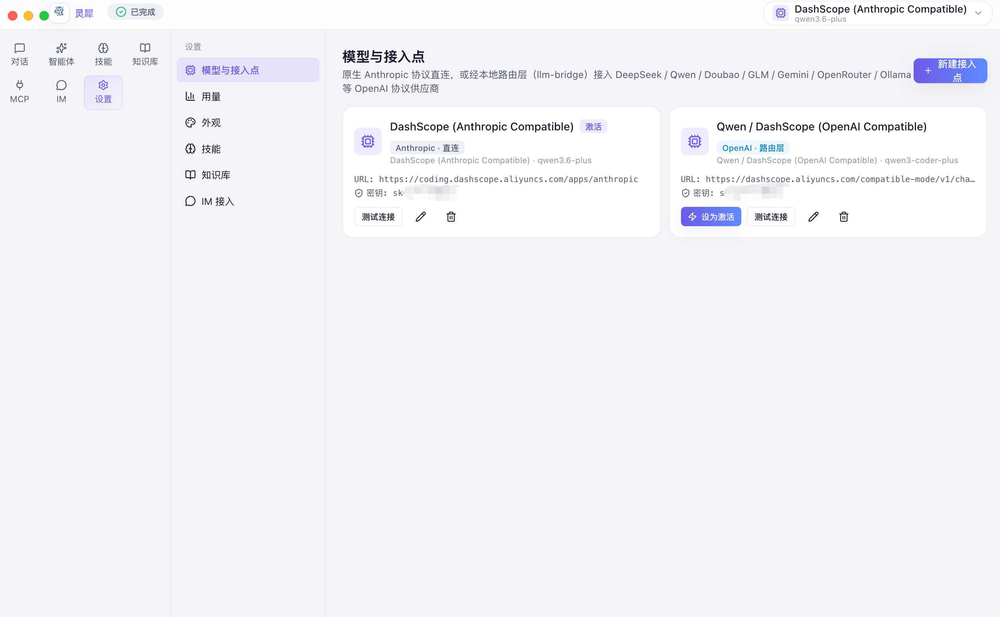
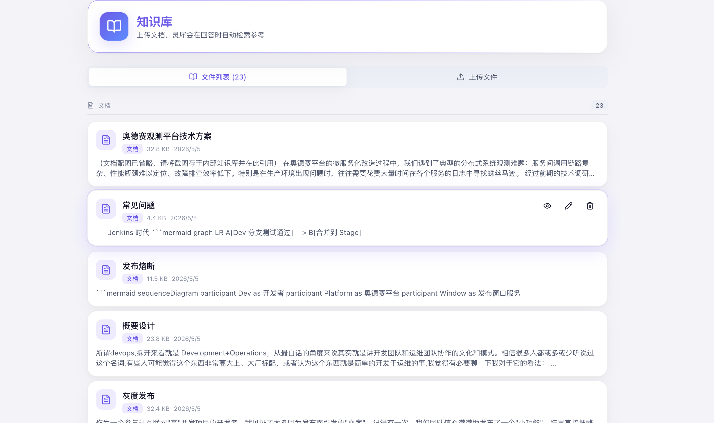
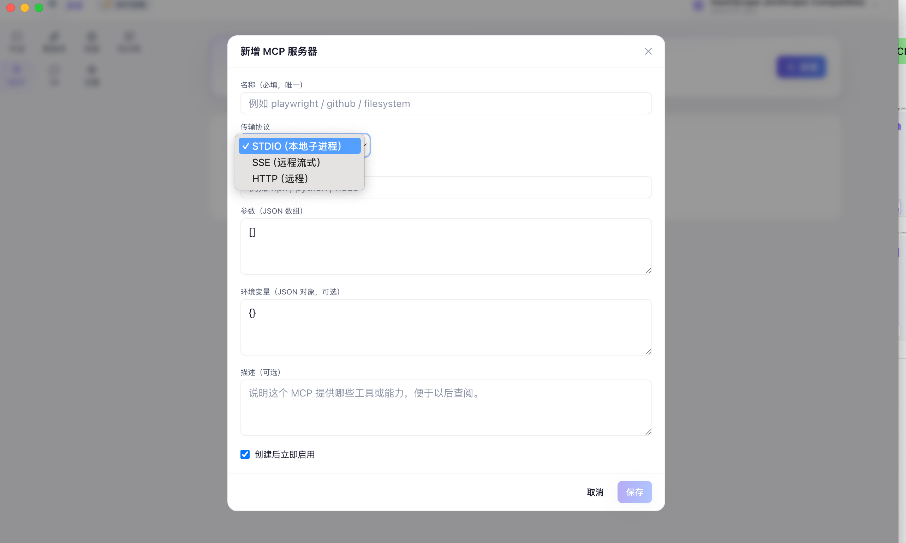
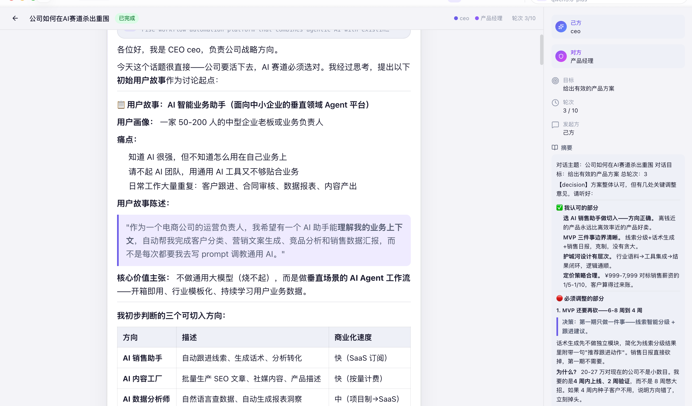

<p align="center">
  
</p>

<h1 align="center">灵犀 AI Agent</h1>

<p align="center">
  <strong>🧠 本地优先 · 🔌 多模型 · 🤖 多智能体 · 🌐 Agent 协作 · 📦 开箱即用</strong>
</p>

<p align="center">
  <em>不只是聊天工具 —— 一个完整的桌面 AI Agent 工作台。</em><br/>
  <sub>创建专属智能体、装备技能与知识库、可视化编排工作流、Agent 间自动对话 —— 全部在你的本地完成。</sub>
</p>

<p align="center">
  <a href="README-EN.md">English</a>&nbsp;&nbsp;|&nbsp;&nbsp;
  <a href="#-核心亮点">核心亮点</a>&nbsp;&nbsp;|&nbsp;&nbsp;
  <a href="#-功能全景">功能全景</a>&nbsp;&nbsp;|&nbsp;&nbsp;
  <a href="#-截图画廊">截图画廊</a>&nbsp;&nbsp;|&nbsp;&nbsp;
  <a href="#-快速开始">快速开始</a>&nbsp;&nbsp;|&nbsp;&nbsp;
  <a href="#-技术架构">技术架构</a>&nbsp;&nbsp;|&nbsp;&nbsp;
  <a href="#-开源协议">License</a>
</p>

<br/>

<p align="center">
  
</p>

<p align="center">
  <sub>▲ 灵犀工作台首页 —— 清爽的对话界面，左侧会话导航，顶部功能入口一目了然</sub>
</p>

---

## 🌟 核心亮点

<table>
<tr>
<td width="50%">

### 🔒 数据 100% 归你
会话、配置、API 密钥全部保存在**本地 SQLite**，密钥使用操作系统级加密（macOS Keychain / Windows DPAPI）。**零云端依赖**，断网也能用已下载的本地模型。

</td>
<td width="50%">

### 🔌 接入 14+ 家模型供应商
Anthropic · OpenAI · DeepSeek · Qwen · Gemini · 豆包 · GLM · Kimi · Groq · Ollama …… 一键切换，不被任何供应商锁定。内置 Bridge 路由层自动翻译协议。

</td>
</tr>
<tr>
<td>

### 🤖 不止聊天，是 Agent 工作台
创建专属智能体，赋予独立的角色设定、技能、知识库和 MCP 工具。让 AI 不只是回答问题，而是**真正完成工作** —— 写代码、查数据、读文档、操作网页。

</td>
<td>

### 🌐 Agent 间自动对话（Project Nexus）
局域网内多台灵犀实例的 Agent **自动发现、一键建联、双向流式对话**。你的代码审查员和同事的架构师可以直接讨论技术方案，人类随时介入监督。

</td>
</tr>
<tr>
<td>

### 📦 双击即用，零配置
macOS 下载 `.dmg` 双击安装。内嵌 Go 后端 + Node.js 运行时 + whisper.cpp 语音引擎 —— **无需 Python、Docker 或任何后端服务**，所有依赖自包含。

</td>
<td>

### 🔄 自动更新 + 6 套精美主题
内置 OTA 增量更新，新版本静默下载、一键安装。提供 **Light / Dark / Midnight / Cyber / Aurora / Cosmos** 六套精心设计的视觉主题，页面切换丝滑动画。

</td>
</tr>
</table>

---

## 🚀 功能全景

灵犀不是又一个 Chat Wrapper。它是一个功能完整的 **AI Agent 生态工作台**，每个模块都经过精心打磨。

---

### 🏭 智能体工厂 —— 你的 AI 团队管理器

> 不是换一个 System Prompt 那么简单。每个智能体是一个拥有 **8 个维度定制能力** 的完整配置实体。

<p align="center">
  
</p>

<table>
<tr>
<td>🎭 <strong>身份与角色</strong></td>
<td>名称、头像（26 个精选 emoji）、描述、完整 System Prompt 自定义</td>
</tr>
<tr>
<td>🧩 <strong>能力装备</strong></td>
<td>独立绑定技能、知识库、MCP 工具 —— 代码审查员不会误用写邮件技能</td>
</tr>
<tr>
<td>🎛️ <strong>参数调节</strong></td>
<td>temperature（精确 0.1 ↔ 创意 0.8）、max_tokens 独立控制</td>
</tr>
<tr>
<td>🌐 <strong>对外协作</strong></td>
<td>公开开关、能力标签、授权级别、禁止透露信息 —— 参与 Nexus 对话时的安全边界</td>
</tr>
<tr>
<td>📋 <strong>17 个内置模板</strong></td>
<td>覆盖商业办公、技术开发、内容创意、生活效率四大场景，也支持五步向导从零创建</td>
</tr>
</table>

<details>
<summary>📦 <strong>内置模板一览（点击展开）</strong></summary>
<br/>

| 场景 | 模板 |
|------|------|
| 🏢 **商业办公** | 销售助理 · 商业分析师 · 人力资源 · 法务顾问 |
| 💻 **技术开发** | 代码审查员 · 架构师 · DevOps 专家 · 安全工程师 · DBA |
| ✍️ **内容创意** | 内容创作者 · 文案策划 · 翻译专家 · 学术论文助手 |
| 🌈 **生活效率** | 产品经理 · 健身教练 · 理财顾问 · 旅行规划师 |

</details>

<p align="center">
  
</p>
<p align="center"><sub>▲ 五步创建向导 —— 角色设定步骤：丰富的 System Prompt 编辑与快速模板</sub></p>

---

### 💬 极致对话体验 —— 为效率而生的每一个细节

> 流式输出不是简单的逐字显示，而是**思考块 + 工具块 + 文本块**的三层内容块精确渲染。

<p align="center">
  
</p>

| 能力 | 描述 |
|------|------|
| ⚡ **流式输出 + 思考链** | 实时逐 token 输出，思考过程可折叠展开，支持 OpenAI 兼容模型 reasoning 透传 |
| 🎨 **代码高亮** | 50+ 种语言语法着色（prism-react-renderer），每个代码块一键复制 |
| 🖼️ **多模态输入** | 图片粘贴（Cmd+V）· 文件拖入（60+ 格式）· 离线语音输入 · 截屏（⌘⇧S） |
| 📚 **RAG 引用可视化** | 知识库检索后内联 `[N]` 上角标，hover 弹出引用卡片，底部折叠引用列表 |
| 🔍 **搜索与命令** | ⌘K 全文搜索 · `/` 斜杠命令（12 种快捷 Prompt）· 消息编辑重发 |
| 🗺️ **两阶段规划模式** | 复杂任务先选方案维度（技术栈/架构/部署…），全部确认后再执行 |
| 💡 **智能回复建议** | 每条 AI 回复后推荐 2-3 个后续问题胶囊按钮，一键继续对话 |
| 📌 **消息管理** | 固定重要消息 · 反馈（👍👎）· 会话置顶 · 批量删除 · Markdown 导出 |
| 🔊 **TTS 朗读** | Web Speech API，助理消息一键朗读，支持中英文自动识别 |
| ⏹️ **对话中止** | 随时停止 AI 回复，已产生的部分内容保留 |

<p align="center">
  
</p>
<p align="center"><sub>▲ 两阶段规划模式 —— 先收集需求维度，确认后再执行，人机协作的决策流程</sub></p>

---

### 🎤 离线语音输入 —— whisper.cpp 内置，无需联网

灵犀内置 **whisper.cpp**（Apple Metal 加速），点击麦克风录音 → 停止 → 本地识别 → 文字自动填入输入框。

**全程离线、零延迟、不依赖任何云端 API。** 网络不可用时自动回退远端 Whisper API。

---

### 🔗 14+ 模型供应商统一接入

> 一个面板管理所有供应商，连通性测试、费用估算、用量追踪 —— 尽在掌握。

<p align="center">
  
</p>

| 协议 | 供应商 |
|------|--------|
| **Anthropic 原生** | Anthropic 官方 · DashScope（阿里云）|
| **OpenAI 兼容** | DeepSeek · Qwen · 豆包 · GLM · Kimi · Gemini · OpenRouter · Groq · SiliconFlow · Ollama · OpenAI |

<details>
<summary>🔧 <strong>Bridge 路由层工作原理（点击展开）</strong></summary>
<br/>

灵犀的 AI 引擎基于 Anthropic 协议。当用户选择 OpenAI 兼容供应商时，本地 Bridge 进程自动启动，在两种协议间做**双向实时翻译**：

```
Claude Code CLI ──Anthropic 协议──► Bridge (127.0.0.1) ──OpenAI 协议──► DeepSeek / Qwen / ...
```

优先使用 LiteLLM（Python），回退到 llm-bridge（Node.js）。用户无感知，切换供应商只需在设置页一键操作。

</details>

---

### 🧩 技能 · 知识库 · MCP —— Agent 的能力三件套

<table>
<tr>
<td width="33%" valign="top">

#### ⚡ 技能系统
- 🤖 **AI 自动生成**：描述需求，流式生成代码
- 📦 **ZIP 导入** / 批量上传
- 🛒 **Smithery 市场**一键安装
- ✏️ 已安装技能在线编辑 / 导出
- 🔗 按智能体独立绑定

</td>
<td width="33%" valign="top">

#### 📚 知识库
- 📄 支持 `.md` `.txt` `.csv` `.json` `.pdf` `.docx`
- 📂 三分类管理（文档 / 问答 / 数据）
- 🖱️ 拖拽批量上传 + 内容预览
- 🔍 自动生成 INDEX 索引
- 📎 RAG 检索 + 引用可视化

</td>
<td width="33%" valign="top">

#### 🔧 MCP 工具
- 📡 stdio / SSE / HTTP 三种协议
- 🌐 内置 Playwright MCP（自动检测 Chrome）
- 📋 配置一键导出（兼容 Claude Desktop）
- 🔌 扩展 Agent 能力边界
- 🤖 让 Agent 操作网页、文件系统…

</td>
</tr>
</table>

<p align="center">
  
</p>
<p align="center"><sub>▲ 技能管理 —— AI 生成 / 市场安装 / 在线编辑 / ZIP 导入，四种方式获取技能</sub></p>

<p align="center">
  
</p>
<p align="center"><sub>▲ 知识库管理 —— 拖拽上传，分类管理，Agent 检索后生成带引用的高质量回答</sub></p>

<p align="center">
  
</p>
<p align="center"><sub>▲ MCP 工具管理 —— 三种协议全支持，一键导出配置</sub></p>

---

### 🔀 可视化工作流编排

> 拖拽节点、连线即可构建 Agent 执行流程 —— 无需写一行代码。

<p align="center">
  
</p>

| 节点 | 说明 |
|------|------|
| 💬 **提示词** | 发送 Prompt 给 AI，获取回复 |
| 🔀 **条件分支** | 根据前一步输出判断走哪条路径 |
| 🔄 **循环** | 重复执行一组节点 N 次 |
| ⏱️ **延迟** | 等待指定时间 |
| 💻 **代码执行** | 运行自定义 Bash / Python 脚本 |
| 📤 **输出** | 最终输出结果 |

---

### 🌐 Project Nexus —— Agent-to-Agent 自动对话网络

> 灵犀独创。让不同灵犀实例的 Agent **自动发现、建联、双向流式对话** —— 与主聊天同款的沉浸式体验。

<p align="center">
  
</p>

```
┌──────────────┐                        ┌──────────────┐
│  灵犀实例 A   │  ◄── 双向流式对话 ──►   │  灵犀实例 B   │
│  🧑 人类 A   │     mDNS 自动发现       │  🧑 人类 B   │
│  🤖 代码审查员│     PSK 密钥建联        │  🤖 架构师   │
│  （观察/介入）│     token 级实时流式    │  （观察/介入）│
└──────────────┘                        └──────────────┘
```

| 能力 | 描述 |
|------|------|
| 🔍 **局域网自动发现** | mDNS 广播 `_lingxi._tcp`，同网络灵犀实例 10 秒内自动可见 |
| 🤝 **一键建联** | PSK 共享密钥验证，双方确认后建立信任，后续通信 Token 加密 |
| ⚡ **双向流式对话** | 双方 Agent 输出均为 token 级实时流式，思考过程同步展示 |
| 🎨 **清晰标识** | 不同颜色头像 + 标签，一眼区分己方/对方 Agent |
| 🧠 **持久上下文** | 每场对话关联独立 Session，Agent 跨轮次保持记忆 |
| 👁️ **双端实时观察** | 发起方和接收方同时看到 Agent 的思考与回复过程 |
| ✋ **人类监督** | 随时暂停 · 人类接管 · 终止对话 · Handoff 自动通知 |
| ✅ **结果审批** | 对话完成后生成摘要，支持人类审批确认或驳回 |
| 📝 **完整渲染** | 代码高亮、表格、列表、思考折叠块 —— 与主聊天同款 UI |

<p align="center">
  
</p>
<p align="center"><sub>▲ Agent 间实时对话 —— 紫色为对方 Agent，主题色为己方 Agent，双方输出实时流式呈现</sub></p>

---

### ⏰ 定时任务 —— 让 Agent 24/7 自动工作

> 每小时检查邮件、每天生成日报、每周清理数据 —— Agent 不知疲倦地为你工作。

<p align="center">
  
</p>

| 调度方式 | 示例 |
|----------|------|
| 每 N 分钟 / 小时 | 每 30 分钟检查一次邮件 |
| 每天 / 每周 / 每月 | 每天 9:00 生成日报、每周一生成周报 |
| 自定义 Cron | `0 */2 * * 1-5`（工作日每 2 小时） |

- ✅ **有状态模式**：Agent 记住上次执行内容，只汇报增量变化
- 🔔 **桌面通知**：执行完成后 macOS / Windows 系统级通知
- 📋 **执行记录**：查看历史执行 + 一键跳转到对应会话

---

### 💬 企业 IM 集成 —— 团队级 AI 自动化

> 把 Agent 能力接入企业沟通工具，群里 @Agent 就能自动回复。

<p align="center">
  
</p>

| 平台 | 接入方式 |
|------|---------|
| 🟢 **企业微信** | 自定义机器人 Webhook |
| 🔵 **钉钉** | 自定义机器人 Webhook |
| 🟣 **飞书** | 自定义机器人 Webhook |

灵犀负责完成各平台的签名验证、消息解析和格式转换，配置 App ID 和密钥即可上线。

---

### 🧠 长期记忆 —— Agent 真的能「记住你」

跨会话的持久记忆系统，**按智能体隔离管理**。

- 🤖 **自动记忆**：AI 在对话中识别到重要信息自动记录（偏好、习惯、重要事项）
- ✍️ **手动添加**：在「设置 > 长期记忆」手动录入
- 🗂️ **分类管理**：查看 · 添加 · 删除 · 按分类筛选 · 一键清空
- 🔒 **隔离安全**：每个 Agent 只能访问自己的记忆，互不串台

---

### 🎨 6 套主题 —— 沉浸式视觉体验

| Light | Dark | Midnight |
|:-----:|:----:|:--------:|
| 清新明亮 · 紫色主调 | 经典暗色 · 护眼舒适 | 深夜黑 · 极致纯净 |

| Cyber | Aurora | Cosmos |
|:-----:|:------:|:------:|
| 赛博朋克 · 青粉霓虹 | 极光 · 绿青渐变 | 宇宙 · 紫粉星云 |

- 🎭 **CSS 变量驱动**：主题切换零闪烁，纯 CSS 行为
- 🌊 **Framer Motion**：AnimatePresence 页面切换丝滑动画
- 🎯 **极光背景**：三层径向渐变叠加，沉浸式视觉氛围

---

### 📊 用量统计与预算预警

<p align="center">
  
</p>

- 📈 **精确计费**：Anthropic 官方 API 精确到 token 级别
- 📊 **本地估算兜底**：非官方供应商按内置定价表估算（标注 `~` 提示近似）
- 🔔 **预算预警**：设置日/月上限，接近预算时 Toast 提醒

---

## 📸 截图画廊

<table>
<tr>
<td></td>
<td></td>
</tr>
<tr>
<td align="center"><sub>🤖 智能体交互 —— Agent 自主执行任务</sub></td>
<td align="center"><sub>🗺️ 规划模式 —— 多维度需求收集</sub></td>
</tr>
<tr>
<td></td>
<td></td>
</tr>
<tr>
<td align="center"><sub>⚙️ 智能体配置 —— 8 个维度精细定制</sub></td>
<td align="center"><sub>📊 Agent 创作 PPT —— AI 真正完成工作</sub></td>
</tr>
<tr>
<td></td>
<td></td>
</tr>
<tr>
<td align="center"><sub>🔗 多模型自由切换 —— 14+ 供应商</sub></td>
<td align="center"><sub>🛒 Smithery 市场 —— 一键安装技能</sub></td>
</tr>
<tr>
<td></td>
<td></td>
</tr>
<tr>
<td align="center"><sub>🔀 可视化工作流 —— 拖拽节点编排流程</sub></td>
<td align="center"><sub>🌐 Nexus 网络 —— Agent 间自动发现与对话</sub></td>
</tr>
</table>

---

## ⌨️ 快捷键

| 快捷键 | 功能 | 快捷键 | 功能 |
|--------|------|--------|------|
| `⌘ K` | 全文搜索消息 | `⌘ N` | 新建对话 |
| `⌘ B` | 折叠 / 展开侧边栏 | `⌘ ,` | 打开设置 |
| `⌘ /` | 显示快捷键面板 | `⌘ ⇧ S` | 截屏到输入框 |
| `/` | 唤起斜杠命令 | `Esc` | 关闭弹窗 / 面板 |
| `Enter` | 发送消息 | `Shift+Enter` | 换行 |

---

## 🏗️ 技术架构

```
┌─────────────────────────────────────────────────────────┐
│                     Electron 36                          │
│  桌面容器 · 窗口管理 · safeStorage 密钥加密 · OTA 更新    │
├──────────────────────────┬──────────────────────────────┤
│     React 19 + Vite 8    │      Go 1.24 + Gin 1.10     │
│  Tailwind CSS 3.4        │   SQLite（纯 Go WASM）       │
│  Zustand 5 · Motion 12   │   WebSocket 流式 · mDNS      │
│  6 套主题 · 虚拟滚动      │   70+ API · 定时调度器       │
│  prism 代码高亮           │   IM 连接器 · Bridge 路由    │
└──────────────────────────┴──────────────────────────────┘
               内嵌运行时（无需安装任何依赖）
    Node.js · whisper.cpp · Claude CLI · LiteLLM Bridge
```

| 层 | 技术 | 说明 |
|----|------|------|
| 🖥️ 桌面壳 | Electron 36 | 窗口管理 · safeStorage · 截屏 · 自动更新 |
| 🎨 前端 | React 19 + Vite 8 + Tailwind 3.4 | 6 主题 · Zustand 状态 · Framer Motion 动画 |
| ⚙️ 后端 | Go 1.24 + Gin + SQLite | 70+ API · WebSocket · mDNS · 定时调度 |
| 🔊 语音 | whisper.cpp (Metal) | 离线 ASR · ggml-base 模型 |
| 🔄 路由 | LiteLLM / llm-bridge | Anthropic ↔ OpenAI 协议双向翻译 |

---

## 📥 快速开始

### macOS（Apple Silicon）

1. **下载** `.dmg` 安装包（[Releases 页面](https://github.com/MT-xjr2/lingxi/releases)）
2. **双击安装**，拖入「应用程序」文件夹
3. 首次打开如提示"无法验证"：
   ```bash
   xattr -cr "/Applications/灵犀.app"
   ```
4. 在「设置 → 模型与接入点」配置至少一个模型 API Key
5. 开始对话！✨

### 从源码构建

```bash
# 前置：Node.js ≥ 20.19, Go ≥ 1.24
git clone https://github.com/MT-xjr2/lingxi.git
cd lingxi-agent && ./build-desktop.sh
# 产物 → dist-electron/mac-arm64/灵犀.app
```

<details>
<summary>🔧 <strong>开发模式（点击展开）</strong></summary>
<br/>

```bash
# 终端 1：前端热更新
cd frontend-desktop && npm install && npm run dev

# 终端 2：Go 后端
cd backend-desktop && go run .

# 终端 3：Electron
cd electron && npm install && npm start
```

</details>

---

## 📜 开源协议

[MIT License](LICENSE)

---

<p align="center">
  <br/>
  
  <br/><br/>
  <strong>灵犀</strong> —— 让 AI 成为你的工作伙伴，而不只是聊天对象。<br/>
  <sub>Built with ❤️ by the Lingxi team</sub>
  <br/><br/>
  ⭐ 如果觉得项目有价值，欢迎在 <a href="https://github.com/MT-xjr2/lingxi">GitHub</a> 上 Star 支持！
</p>
